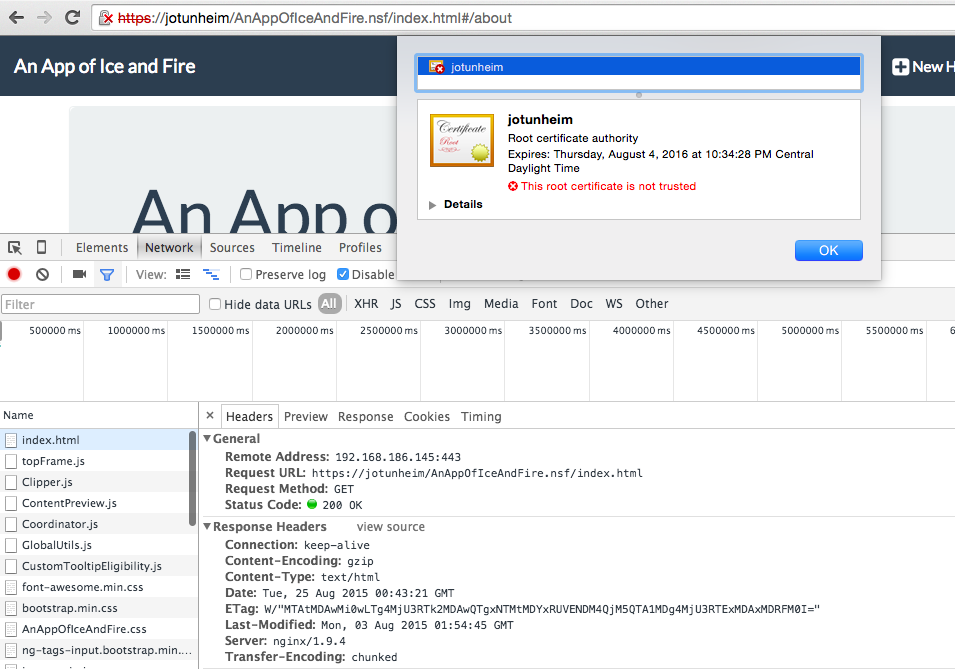

## AD113: Speed Up Your Applications With Nginx and PageSpeed

This is a collection of the slide deck (in both PDF and PPTX format), which can also be [found on slideshare](http://www.slideshare.net/edm00se/ad113-speed-up-your-applications-w-nginx-and-pagespeed), along with the configuration files and some screen shots showing what was going on in the demos. I suggest you check out the slides.

### Motivation

Improving application performance is a big deal for me. My day job involves my working to support users across a majority of the North American continent. This makes me very conscientious of how my application server acts and interacts with the user's browser, and anything or everything in-between.

### Concepts

Basically, part of my push for better structures apps (of which I'm not alone on, [Shean P. McManus gave a session on navigating many of the same parts]
(https://www.youtube.com/watch?v=UCEIU7zqaKo) involving web frameworks), along with an emphasis on transport of data in place of markup, our applications can be fast enough to contend with many of the shiny, new kids on the block.

### Caching

Just as we set _no-cache_ headers on our APIs to "preserve freshness", we can use caching (both in the browser and in cache pools with the reverse proxy, depending on your deployment strategy) to guarantee faster page load times.

### PageSpeed Modules

Most of what PageSpeed can do for us can be done natively in Nginx; the PageSpeed module just makes it incredibly easy. A number of useful PageSpeed enhancements we can get are:

* whitespace and comment removal (preserving useful ones like HTML5shiv for IE, etc.) in HTML
* header rewrites
* JS and CSS minification
* JS and CSS concatenation (joining of the files, to reduce the number of network calls)
* even CDN related prefetching
* crazy advanced things like resizing of images

### HTTPS/SSL Handoff

Nginx also lets us provide, by nature of being a reverse proxy and full web server, the ability to provide HTTPS connections, when there are otherwise none. If your application server is a little sluggish in responding to an HTTPS/SSL security threat, you may take note of the ability to provision your HTTPS traffic without needing to have any unencrypted connection leave your server (provided you roll an Nginx instance on the same OS as your application server).

### Summary

All in all, this is a professional tool we can add to enhance our applications and better secure ourselves. A win all around.

#### A Taste

My demos included each of the above concepts and here's a quick teaser screen shot from my final demo, which provided a majority of the PageSpeed filters, header rewrites, caching of all static content, HTTPS handling (a self-signed certificate, hence the errors/warnings), and enforcement of HTTPS (port 80 redirects to 443, no direct port 80 access to the app server); most things one would start with for a production environment.

To view my sample config files, check out the config folder. Here's a quick break down of the files of note.

| Config                                      | Demonstrates                               |
| --------------------------------------------|--------------------------------------------|
| nginx.conf_default                          | generic config, OoB                        |
| nginx.conf_simpleProxy                      | a no-frills proxy                          |
| nginx.conf_vanillaServer                    | simple server, no proxy                    |
| nginx.conf_PageSpeed-ified                  | ngx_pagespeed enabled w/ goodies           |
| nginx.conf_selfSignedSSL_PageSpeed          | w/ ngx_pagespeed & self-signed cert        |
| nginx.conf_selfSignedSSL_PageSpeed_forceSSL | w/ ngx_ps, self-signed cert, forcing HTTPS |

### License

As is my norm for my blog and my GitHub repositories, the work contained herein is licensed under a <a href="//creativecommons.org/licenses/by/3.0/">Creative Commons Attribution 3.0 Unported License</a>. You may use, alter, and redistribute the code herein (with citation), while expecting no warranty for its use.